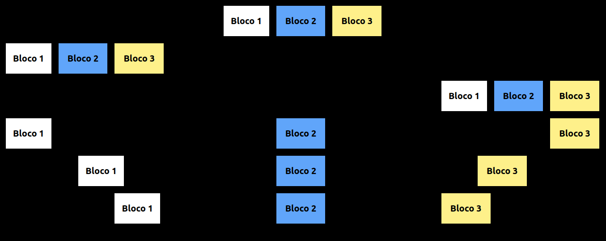

<h1 align="center">Flexbox Tailwind</h1>

<h3 align="center">https://brunocabralsilva.github.io/flexbox-tailwind/</h3>

<h4>Projeto criado com o intuito de criar uma aplicação para um artigo redigido para a Revelo Community, onde foi falado sobre o Flexbox do Tailwind e como utilizá-lo. Desta forma a aplicação exemplifica algumas das classes do tailwind que utilizam o conceito flexbox para organização espacial e de alinhamento.</h4>

